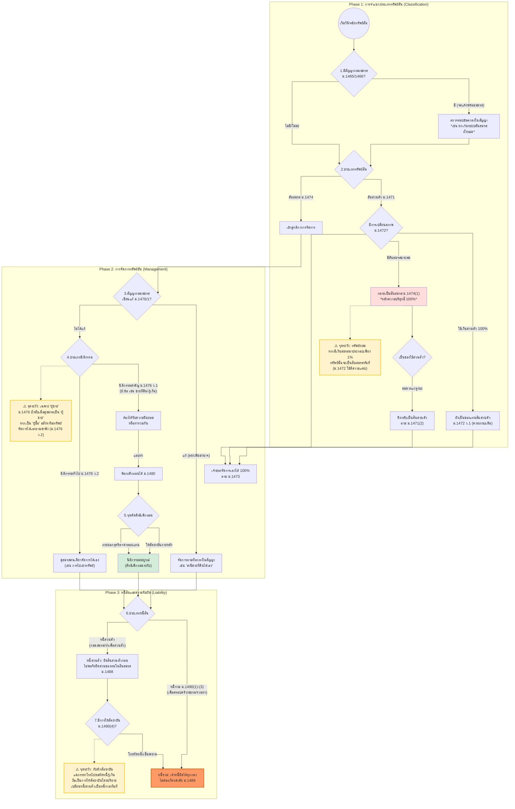

```mermaid
graph TD
%%{init: {'flowchart': {'curve': 'stepAfter'}}}%%

subgraph "Phase 1: การจำแนกประเภททรัพย์สิน (Classification)"
    Start((เริ่มวินิจฉัยทรัพย์สิน)) --> IsPrenup{1.มีสัญญาก่อนสมรส<br/>ม.1465/1466?}
    
    IsPrenup -- "มี (จดแจ้งพร้อมสมรส)" --> PrenupEffect["ตรวจสอบข้อตกลงในสัญญา<br/>*เช่น ยกเว้นระบบสินสมรสทั้งหมด*"]
    IsPrenup -- "ไม่มี/โมฆะ" --> AssetType{2.ประเภททรัพย์สิน}
    PrenupEffect --> AssetType

    AssetType -- "สินส่วนตัว ม.1471" --> PrivateCheck{มีการเปลี่ยนสภาพ<br/>ม.1472?}
    AssetType -- "สินสมรส ม.1474" --> MaritalFlow[เข้าสู่กติกาการจัดการ]

    PrivateCheck -- "ใช้เงินส่วนตัว 100%" --> StillPrivate["ยังเป็นของแทนสินส่วนตัว<br/>ม.1472 ว.1 (คงสถานะเดิม)"]
    PrivateCheck -- "มีสินสมรสมาผสม" --> MixedMarital["กลายเป็นสินสมรส ม.1474(1)<br/>*หลักความบริสุทธิ์ 100%*"]
    
    MixedMarital --> PersonalUse{เป็นของใช้ส่วนตัว?}
    PersonalUse -- "สมควรแก่ฐานะ" --> BackToPrivate["ดึงกลับเป็นสินส่วนตัว<br/>ตาม ม.1471(2)"]

    %% Caution 1 %%
    MixedMarital -.-> Caution1["⚠️ จุดระวัง: ทรัพย์ผสม<br/>หากมีเงินสมรสมาประกอบเพียง 1%<br/>ทรัพย์นั้นจะเป็นสินสมรสทันที<br/>(ม.1472 ใช้ตีความแคบ)"]
end

subgraph "Phase 2: การจัดการทรัพย์สิน (Management)"
    StillPrivate & PrivateCheck & BackToPrivate --> PrivateManage["เจ้าของจัดการเองได้ 100%<br/>ตาม ม.1473"]
    
    MaritalFlow --> Check1476_1{3.สัญญาก่อนสมรส<br/>เขียนแก้ ม.1476/1?}
    
    Check1476_1 -- "แก้ (ลด/เพิ่มอำนาจ)" --> PrenupPower["จัดการตามที่ตกลงในสัญญา<br/>เช่น 'สามีขายที่ดินได้เอง'"]
    Check1476_1 -- "ไม่ได้แก้" --> LawDefault{4.ประเภทนิติกรรม}

    LawDefault -- "นิติกรรมสำคัญ ม.1476 ว.1<br/>(8 ข้อ เช่น ขายที่ดิน/กู้เงิน)" --> MustConsent["ต้องได้รับความยินยอม<br/>หรือทำร่วมกัน"]
    LawDefault -- "นิติกรรมทั่วไป ม.1476 ว.2" --> ManageAlone["คู่สมรสคนเดียวจัดการได้เอง<br/>(เช่น การไปเช่าทรัพย์)"]

    MustConsent -- "แอบทำ" --> Voidable["ฟ้องเพิกถอนได้ ม.1480"]
    Voidable --> RevokeCheck{5.จุดตัดสิทธิเพิกถอน}
    
    RevokeCheck -- "ให้สัตยาบันภายหลัง" --> Valid["นิติกรรมสมบูรณ์<br/>(สิทธิเพิกถอนระงับ)"]
    RevokeCheck -- "ภายนอกสุจริต+ค่าตอบแทน" --> Valid

    %% Caution 2 %%
    LawDefault -.-> Caution2["⚠️ จุดระวัง: เฉพาะ 'ผู้ขาย'<br/>ม.1476 บังคับเมื่อคู่สมรสเป็น 'ผู้ขาย'<br/>หากเป็น 'ผู้ซื้อ' อสังหาริมทรัพย์<br/>จัดการได้เองตามลำพัง (ม.1476 ว.2)"]
end

subgraph "Phase 3: หนี้สินและความรับผิด (Liability)"
    Valid & ManageAlone & PrenupPower --> DebtType{6.ประเภทหนี้สิน}
    
    DebtType -- "หนี้ร่วม ม.1490(1)-(3)<br/>(เพื่อครอบครัว/สมรส/ร่วมทำ)" --> JointDebt["หนี้ร่วม: เจ้าหนี้ยึดได้ทุกกอง<br/>ไม่ต้องเรียงลำดับ ม.1489"]
    
    DebtType -- "หนี้ส่วนตัว<br/>(ก่อนสมรส/ทำเพื่อส่วนตัว)" --> PersDebt["หนี้ส่วนตัว: ยึดสินส่วนตัวก่อน<br/>ไม่พอจึงยึดส่วนของตนในสินสมรส<br/>ม.1488"]
    
    PersDebt --> Ratification{"7.มีการให้สัตยาบัน<br/>ม.1490(4)?"}
    Ratification -- "โทรผัดหนี้/เซ็นพยาน" --> JointDebt

    %% Caution 3 %%
    Ratification -.-> Caution3["⚠️ จุดระวัง: กับดักสัตยาบัน<br/>แค่ภรรยาโทรไปขอผัดหนี้กู้เงิน<br/>ถือเป็นการให้สัตยาบันโดยปริยาย<br/>เปลี่ยนหนี้ส่วนตัวเป็นหนี้ร่วมทันที"]
end

style Caution1 fill:#fff3cd,stroke:#ffc107,stroke-width:2px
style Caution2 fill:#fff3cd,stroke:#ffc107,stroke-width:2px
style Caution3 fill:#fff3cd,stroke:#ffc107,stroke-width:2px
style MixedMarital fill:#fdd
style JointDebt fill:#f96,stroke:#d35400,stroke-width:2px
style Valid fill:#d4edda
```